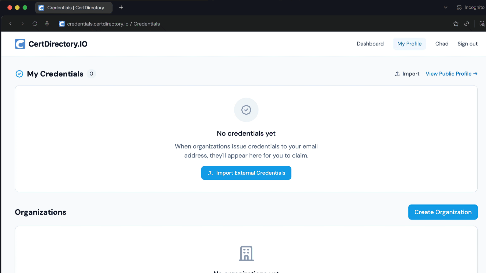

# Quickstart

Issue your first verifiable credential in about five minutes.

## 1. Create your account

1. Go to [credentials.certdirectory.io](https://credentials.certdirectory.io) and click **Sign up**.
2. Register with email + password or **Continue with Google**.
3. If you signed up with email, check your inbox and click the verification link. (You can't create organizations until your email is verified.)

## 2. Create an organization

Organizations are the issuers. Every credential is signed by an organization, not a personal account.
1. From the dashboard, click **Create Organization**.
2. Fill in your organization's **name**, **website**, and a short **description**. The slug is generated automatically and forms part of your public organization URL: `/o/your-slug`.
3. Submit. Your organization enters **`pending_review`** status while we verify it.

!!! info "Approval"
    During the review window you can fully set up your organization — create badges, generate signing keys, configure team — but you cannot issue credentials until you're approved. Approval is typically completed within one business day.

## 3. Generate signing keys

Credentials are signed with your organization's Ed25519 keypair.
1. Once verified, open your organization page (`/organizations/{id}`).
2. In the **Signing keys** section, click **Generate signing keys**. (Owner only.)
3. Your public key is now published at `/issuers/{slug}/did.json`. The private key is stored encrypted on the server and never leaves it.

!!! warning "One-time action"
    Keys are generated once. Re-generation is not exposed in the UI to protect existing credentials' verifiability.

## 4. Create a badge

Badges are templates — the *thing* you award.
1. Go to **Badge templates → New badge**.
2. Upload a badge image (PNG, JPEG, WebP, or SVG; max 5 MB), and fill in the name, description, and criteria.
3. Optionally set **Expires in days** (e.g. `730` for two years) and add **skills** as tags.
4. Save.

## 5. Issue your first credential

1. From the badge detail page, click **Issue this credential**.
2. Enter the recipient's **name** and **email**.
3. The form runs a real-time **recipient check** — if the recipient has previously received this badge, you'll see a banner explaining whether the action is a fresh issue, a renewal, or blocked. (See [Issuing Credentials](../organizations/issuing-a-credential.md).)
4. Check **Make this credential publicly verifiable** if you want anyone with the link to view it (recommended).
5. Click **Issue credential**.

The recipient receives an email with a **View & Verify** link pointing at `/verify/{credential-id}`.

## 6. Verify the credential

Open the verification link. You'll see the credential's status (**Valid**), the badge image, the issuer, the recipient, the issue date, the skills, and live signature/expiration checks.

That's it — your first verifiable credential is live.

## Next steps

- Invite teammates: [Members & Roles](../organizations/members-and-roles.md).
- Issue many at once: [Bulk Issuance](../organizations/bulk-issuance.md).
- Build an integration: [API Reference](../api/overview.md).
- Understand the model: [Key Concepts](concepts.md).
